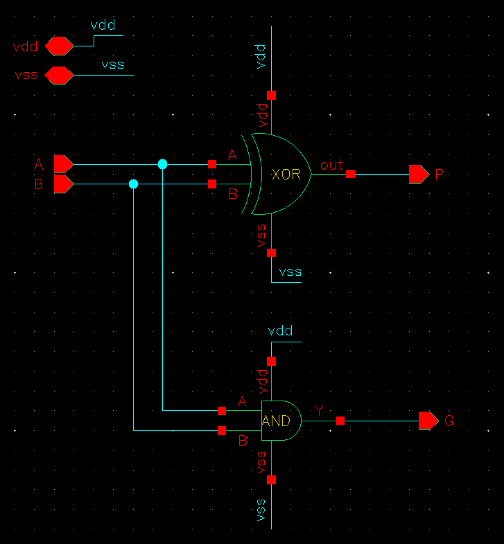
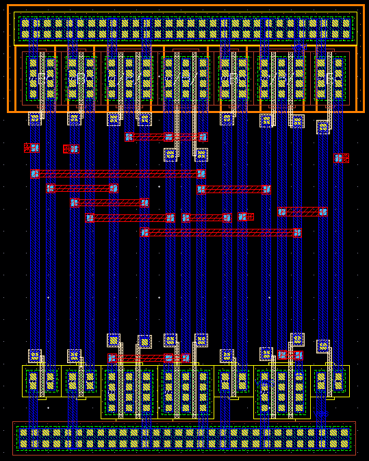
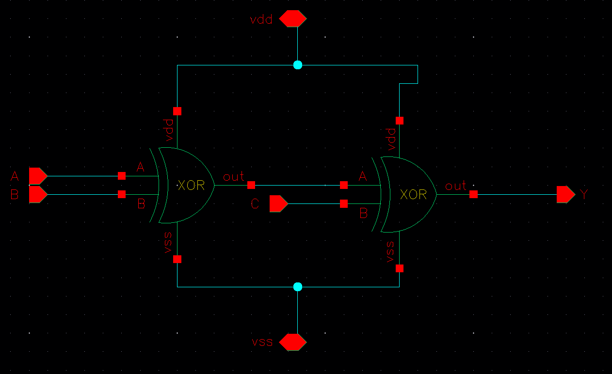
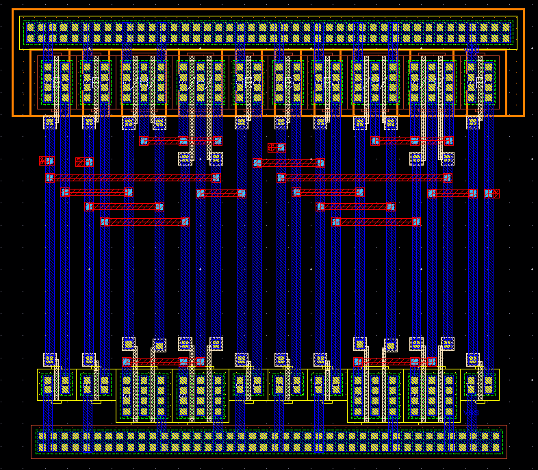
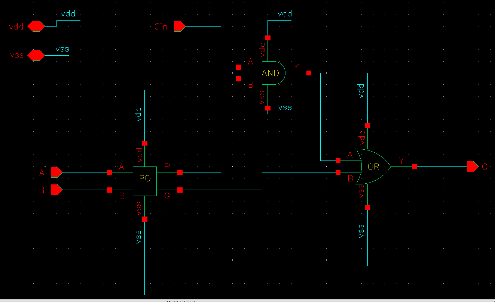
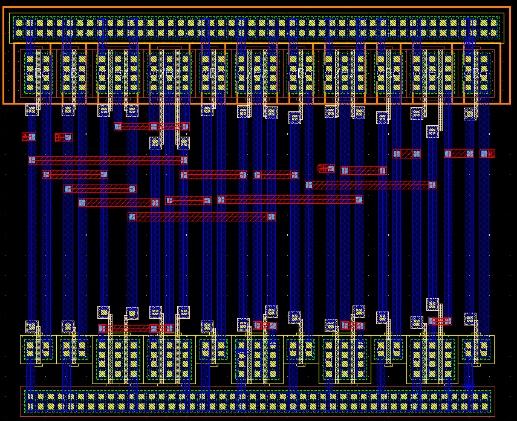
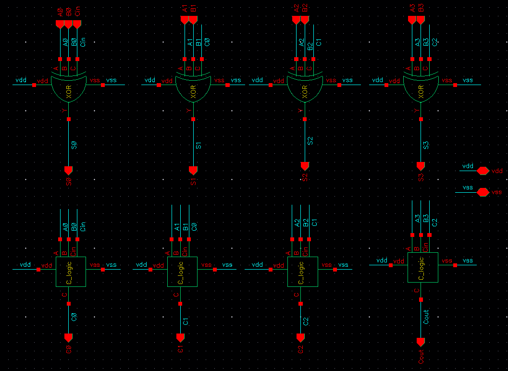
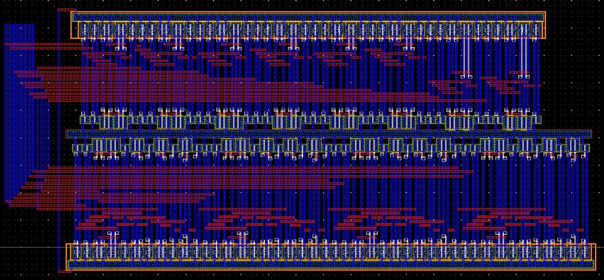

# 4-Bit Carry Lookahead Adder (CLA)
**Cadence Virtuoso · GPDK 180nm · Static CMOS**

---

## Overview

A **Carry Lookahead Adder (CLA)** solves the main problem with a Ripple Carry Adder — waiting for each carry to ripple through every stage. Instead, CLA pre-computes all carry signals at once using two intermediate signals per bit:

- **Propagate (P) = A ⊕ B** — carry passes through this bit
- **Generate (G) = A · B** — carry is created at this bit

With P and G known, all carries are computed in parallel:

```
C1 = G0 + P0·Cin
C2 = G1 + P1·G0 + P1·P0·Cin
C3 = G2 + P2·G1 + P2·P1·G0 + P2·P1·P0·Cin
```

The sum for each bit is then simply:  `S = P ⊕ C`

This design is built hierarchically from three sub-cells: **PG**, **3-input XOR**, and **C_logic**.

---

## Cell 1 — PG Logic

Computes the Propagate and Generate signals from two input bits.

**Schematic**



- `P = A ⊕ B`  →  XOR gate
- `G = A · B`  →  AND gate

Both outputs feed the carry logic and the sum logic of the same bit slice.

**Layout**



---

## Cell 2 — 3-Input XOR (Sum)

Computes the final sum bit: `S = A ⊕ B ⊕ Cin`

**Schematic**



Implemented as two cascaded 2-input XOR gates. The first XOR computes `A ⊕ B`, and the second XOR takes that result with `Cin` to produce the sum. Both stages share the same VDD/VSS rails.

**Layout**



---

## Cell 3 — Carry Logic (C_logic)

Computes the carry-out for each bit: `Cout = G + P · Cin`

**Schematic**



- AND gate computes `P · Cin`
- OR gate combines with G to produce `Cout`

This cell takes P and G from the PG cell and the lookahead carry Cin from the previous stage.

**Layout**



---

## Top-Level Schematic

Four bit-slices (bit 0 to bit 3), each containing a 3-input XOR and a C_logic cell. The PG cell feeds both. Carry signals flow forward; sum bits are independent outputs.

**Schematic**



| Port | Direction | Description |
|------|-----------|-------------|
| A[3:0], B[3:0] | Input | 4-bit operands |
| Cin | Input | Carry-in |
| S[3:0] | Output | Sum bits |
| Cout | Output | Final carry-out |

---

## Full Layout



All four bit-slices placed and routed in Cadence Virtuoso. Power rails run horizontally (VDD top, VSS bottom). Signal routing uses Metal 1 and Metal 2.

- **DRC** — Passed
- **LVS** — Passed

---

## Tools

| | |
|---|---|
| EDA Tool | Cadence Virtuoso |
| PDK | GPDK 180nm |
| Supply | 1.8 V |
| Verification | DRC, LVS |

---

*Designed by Raghul — Digital VLSI, GPDK 180nm*
